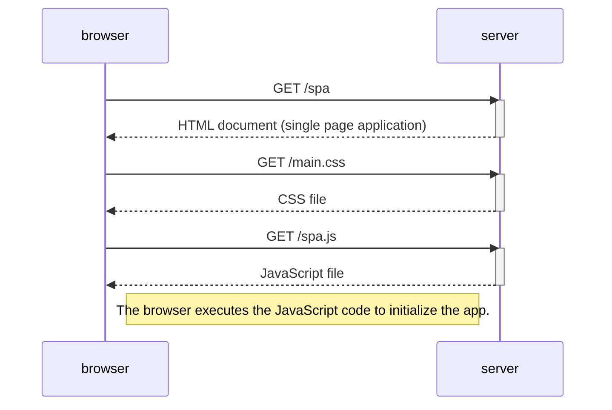

```mermaid
sequenceDiagram
    participant browser
    participant server

browser->>server: GET /spa
activate server
server-->>browser: HTML document (single page application)
deactivate server

browser->>server: GET /main.css
activate server
server-->>browser: CSS file
deactivate server

browser->>server: GET /spa.js
activate server
server-->>browser: JavaScript file
deactivate server

Note right of browser: The browser executes the JavaScript code to initialize the app.
```
