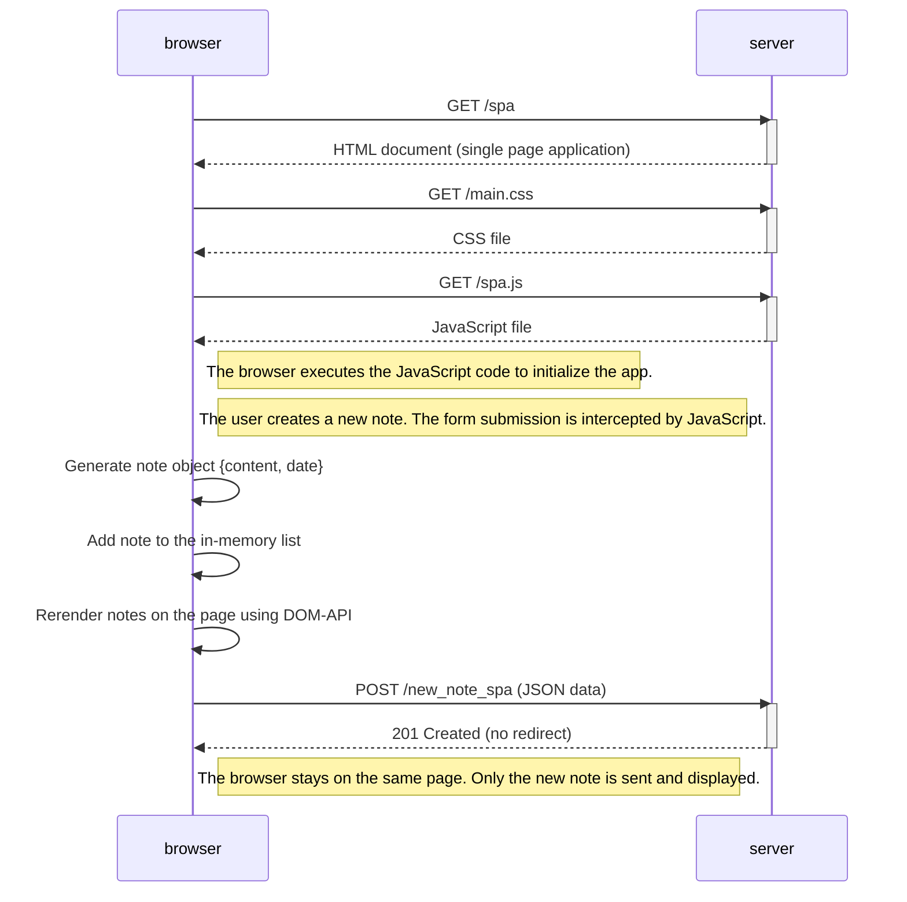

```mermaid
sequenceDiagram
    participant browser
    participant server

browser->>server: GET /spa
activate server
server-->>browser: HTML document (single page application)
deactivate server

browser->>server: GET /main.css
activate server
server-->>browser: CSS file
deactivate server

browser->>server: GET /spa.js
activate server
server-->>browser: JavaScript file
deactivate server

Note right of browser: The browser executes the JavaScript code to initialize the app.

Note right of browser: The user creates a new note. The form submission is intercepted by JavaScript.

browser->>browser: Generate note object {content, date}
browser->>browser: Add note to the in-memory list
browser->>browser: Rerender notes on the page using DOM-API

browser->>server: POST /new_note_spa (JSON data)
activate server
server-->>browser: 201 Created (no redirect)
deactivate server

Note right of browser: The browser stays on the same page. Only the new note is sent and displayed.
```
